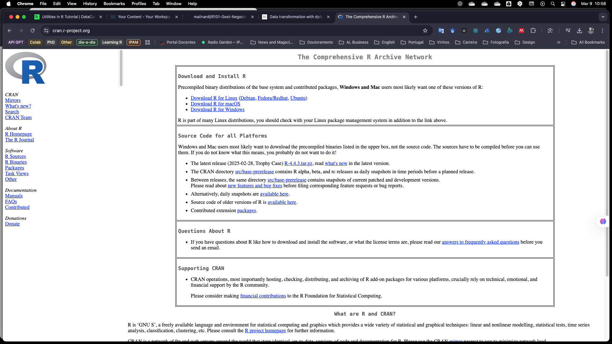
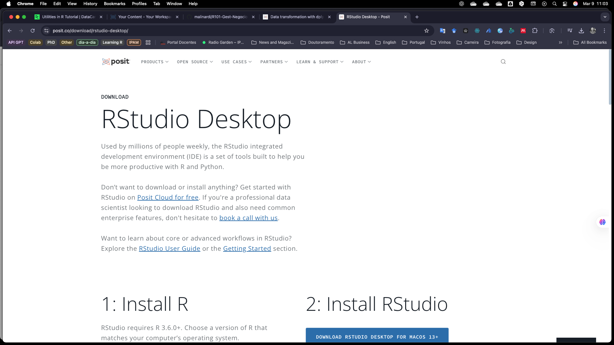
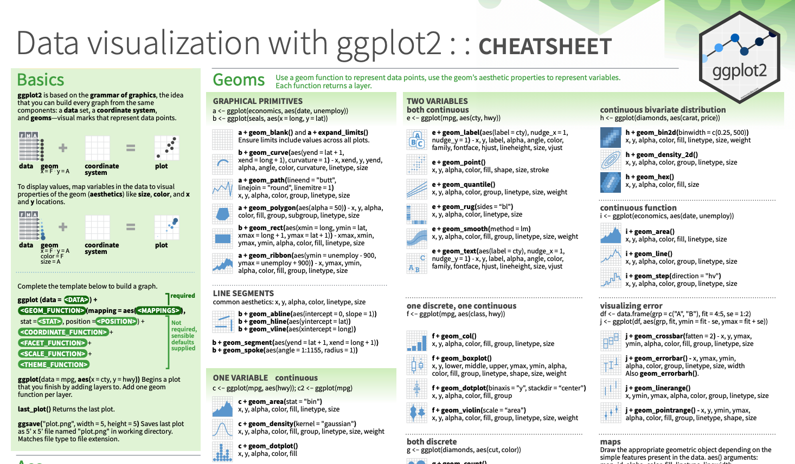
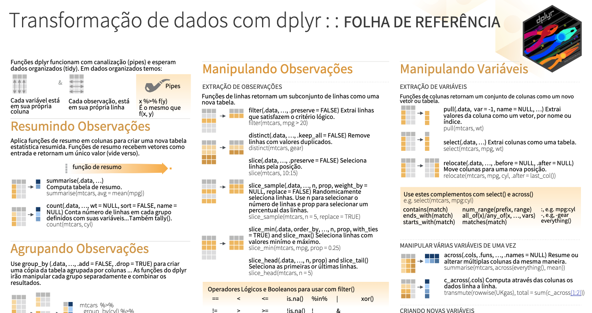
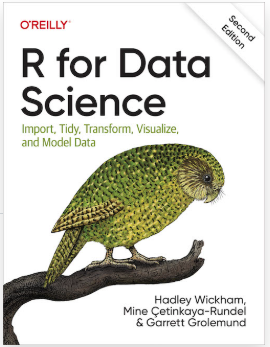

```{r setup, include=FALSE}
knitr::opts_chunk$set(echo = TRUE)
```

------------------------------------------------------------------------

*Este ficheiro foi escrito utilizando R Markdown. Uma maneira simples de formatar códigos R para criação de documentos HTML, PDF, Word e PowerPoint.*

*Quando clica no botão Knit, é gerado um documento que inclui tanto o conteúdo como a saída de quaisquer partes de código R incorporadas no documento. Pode incorporar um pedaço de código R da seguinte forma:*

*Para mais detalhes consulte <http://rmarkdown.rstudio.com>.*

------------------------------------------------------------------------

## 1. Introdução.

### Por que R em Gestão de Negócios?

#### 🎯 O R é uma das linguagens mais poderosas para análise de dados, estatística e visualização, sendo amplamente utilizado no mundo académico e corporativo. Mas, afinal, por que um gestor de negócios deveria aprender R?

**1️⃣ Decisões baseadas em dados (Data-Driven Decision Making).**

O mundo dos negócios está cada vez mais orientado por dados. O R permite:

✅ Analisar grandes volumes de dados e identificar padrões.\
✅ Criar relatórios automatizados para suportar decisões estratégicas.\
✅ Gerar previsões de vendas, procura ou tendências de mercado.

**2️⃣ Alternativa ao Excel – Mais poder e flexibilidade**

O R permite fazer tudo o que o Excel faz (e muito mais) com maior precisão e eficiência. Embora o Excel seja uma ferramenta essencial, ele tem limitações quando se trata de:

❌ Trabalhar com grandes quantidades de dados.\
❌ Criar modelos estatísticos avançados.\
❌ Automatizar processos repetitivos.

**3️⃣ Visualização de Dados Profissional e Interativa.**

✅ O R possui bibliotecas como ggplot2 que criam gráficos sofisticados e personalizados.

✅ Pode gerar dashboards interativos com Shiny, úteis para acompanhamento de KPIs empresariais.

**4️⃣ Machine Learning e Inteligência Artificial.**

O R é uma excelente ferramenta para aplicar modelos preditivos e inteligência artificial em negócios:

✅ Análise de sentimentos em redes sociais.\
✅ Recomendação de produtos baseada no comportamento dos clientes.\
✅ Deteção de fraudes em transações financeiras.

**5️⃣ Open Source, Gratuito e com uma Comunidade Forte.**

Diferente de softwares pagos (como SAS ou SPSS), o R é 100% gratuito e constantemente atualizado pela sua comunidade global. Além disso:\
✅ Possui milhares de pacotes prontos para diferentes áreas de negócio.\
✅ Tem uma enorme quantidade de recursos de aprendizagem gratuitos.

O R é uma ferramenta poderosa, flexível e gratuita, permitindo que gestores tomem decisões mais informadas e automatizem tarefas complexas.

**🚀 e para sua carreira: pode ser um ótimo diferencial no currículo!**

 

## 2. Diferenças entre R e R Studio?

**✅ R (a linguagem).**\
• É a linguagem de programação usada para estatística, análise de dados e machine learning.\
• Funciona em linha de comando (terminal) sem interface gráfica.\
• Pode ser usado sozinho, mas é menos amigável para iniciantes.

**✅ RStudio (o ambiente de desenvolvimento - IDE).**\
• É uma ferramenta que facilita o uso do R com uma interface organizada.\
• Oferece um editor de scripts, visualização de gráficos e gestão de pacotes num só lugar.\
• Não substitui o R – precisas do R instalado para que o RStudio funcione.

👋🏻 Como instalar o R e o RStudio.

Pode sempre utilizar o Posit Cloud na nuvem até que a sua conta atinja os limites de processamento ou o número máximo de projetos permitidos na versão gratuita.

Se preferir, também pode instalar estas aplicações no seu computador e assim evitar qualquer limitação da conta. Para isso, basta seguir estes passos, começando pela instalação do R e, em seguida, do RStudio.

Para instalar o R vá ao CRAN - The Comprehensive R Archive Network em <https://cran.r-project.org/> e selecione a versão correspondente ao seu sistema operacional.

  \
 

Para instalar o R-Studio vá ao site do fornecedor da ferramenta Posit Cloud em <https://posit.co/download/rstudio-desktop/> e baixe a versão correspondente ao seu sistema operacional.

  \
A partir de agora, utilize sempre o R Studio.

 

## 3. Aplicação Real

Toda vez que vamos utilizar o R é necessário preparar o ambiente às suas necessidades. Para isso deve informar quais pacotes (recursos) vamos necessitar. O comando abaixo, verifica se tais pacotes já estáo instalados, caso negativo antes de carregá-los ele instala os pacotes e na sequência carrega-os para a memória do computador.

```{r}
# limpar a memória do computador
rm(list = ls())

# instalador de pacotes que otimiza recursos
if(!require(pacman)) install.packages("pacman")
library(pacman)

pacman::p_load(tidyverse,
                 rmarkdown, 
                 knitr, 
                 kableExtra,
                 GGally, 
                 DataExplorer,
                 gplots,
                 SmartEDA
                 )

#mostra quais pacotes estão carregados
p_loaded()
```

\
Nesta demonstração dos recursos e potencialidades do R, vamos utilizar dois ficheiros que estão no CANVAS. Então devemos carregar os ficheiros para o nosso ambiente de trabalho.\

```{r}

## Carregar ficheiro tipo CSV
dados <- read.csv("video games sales.csv", sep = ";", dec = ".", stringsAsFactors = FALSE)
## Verificar a estrutura dos dados
ExpData(dados,type=1) 
ExpData(dados,type=2) 
str(dados) 

```

Uma vez que o conjunto de dados esteja adequado, podemos obter uma análise univariada de cada uma das variáveis presentes no ficheiro. Este comando faz isso de forma rápida e para todas as variáveis contidas no ficheiro.

```{r}
# Guardar em estatisticas os principais parámetros das variáveis
estatisticas <- ExpNumStat(dados, Outlier = TRUE, Nlim=1)

# Apresentar os parámetros
estatisticas

# A tabela dos parámetros ficou grande (observe que são apresentadas 23 colunas 😳)!
# Então podemos criar a tabela com paginação nativa
estatisticas %>%
  kbl(format = "html") %>%
  kable_paper(full_width = FALSE) %>%
  scroll_box(width = "100%", height = "500px")

# Ou podemos escolher (select) alguns dos porametros e não todos como antes...
est_shor <- estatisticas %>%
  dplyr::select(Vname, mean, SD, min, max, median, nOutliers, NA_Value)

# Apresentar os parámetros selecionados
est_shor

```

**As vezes, uma avaliação visual vale mais que 1.000 números!!! 😂**

```{r}
#Análise das variáveis categóricas
plot_bar(dados)

#Análise das variáveis numéricas
plot_histogram(dados)
plot_density(dados)

```

A análise visual nos mostrou alguns pontos que merecem reflexão:

1.  A variável Publisher apresenta mais de 50 categorias e por isso não foi gerado gráfico. Alguns destes publisher se calhar tem apenas 1 game... Faz sentido classficar os publishers com menos de n games como outros?

2.  A variável plataforma traz por vezes diversos consoles de uma mesma plataforma, por exemplo PS2, PS e PS3. Que tal criarmos uma variável contendo a plataforma em sua versão mais consolidada?

então... vamos a isso!!!

1)  Contar o número de jogos que cada publisher desenvolveu:

```{r}
# Agrupar a informação de número de jogos por Publisher
publisher_count <- dados %>%
  group_by(Publisher) %>%
  summarise(n_games = n()) %>%
  arrange(desc(n_games))  # Ordenar do maior para o menor


```

Agrupar em uma nova variável e rodar novamente a análise gráfica das variáveis categóricas:

```{r}
n_limite <- 60  # Define o mínimo de jogos para não ser classificado como "Outros"; neste caso formando 10 categorias

# Criar uma nova coluna com "Outros" para publishers com poucos jogos
dados <- dados %>%
  mutate(Publisher_Grouped = ifelse(Publisher %in% publisher_count$Publisher[publisher_count$n_games >= n_limite], 
                                    Publisher, 
                                    "Outros"))

# refazer a análise visual das variáveis categóricas
plot_bar(dados)
```

2)  Agrupar as plataformas no "sistemas mãe"

```{r}
dados <- dados %>%
  mutate(Platform_Grouped = case_when(
    Platform %in% c("PS", "PS2", "PS3", "PS4", "PS5", "PSP", "PSV") ~ "PlayStation",
    Platform %in% c("X360", "XB", "XOne", "XSX") ~ "Xbox",
    Platform %in% c("Wii", "WiiU") ~ "Nintendo Wii",
    Platform %in% c("DS", "3DS", "GB", "GBA") ~ "Nintendo Handheld",
    Platform %in% c("NES", "SNES", "N64", "GC", "Switch") ~ "Nintendo Console",
    Platform %in% c("GEN", "SAT", "DC", "SCD") ~ "Sega",
    TRUE ~ "Other"  # Para outras plataformas
  ))

# refazer a análise visual das variáveis categóricas
plot_bar(dados)
```

Uma vez ajustadas as questões observadas anteriormente na análise univariada, podemos partir para a análise bivariada

```{r}
# inicialmente vamos ver as variáveis categóricas por Plataforma
plot_bar(dados, by = "Platform_Grouped")

# depois para as variáveis numéricas

plot_boxplot(dados, by = "Platform_Grouped")
plot_boxplot(dados, by = "Genre")
plot_boxplot(dados, by = "Publisher_Grouped")

```

**Momento para reflexão: temos todas as respostas /informações que desejamos?**

Sempre podemos utilizar o GGPLOT2, uma robusta e potente biblioteca (linguagem) para gerar gráficos!

\
\
Imagine que desejamos ver as vendas em uma determinada região por tipo de jogos lançado ao longo dos anos...

```{r}

ggplot(dados, aes(x= Year, y= Japan, color = Platform_Grouped)) + 
  geom_point() +
    labs(
    title = "Vendas de Videojogos ao Longo dos Anos",
    x = "Ano",
    y = "Vendas no Japão (em milhões €)"
  ) +
  theme_minimal() 
    
```

se desejarmos ver as vendas mundiais por tipo de plataforma

```{r}
# Por plataforma agrupada
ggplot(dados , aes(x=Platform_Grouped, y= Global, fill = Platform_Grouped)) + 
  geom_col() +
  theme_grey()

# Por plataforma
ggplot(dados , aes(x=Platform, y= Global, fill = Platform_Grouped)) + 
  geom_col() +
  theme_classic()

```

\
Se desejarmos ver a relação das vendas com reviews, separados por tipo de plataforma.

```{r}

dadosf <- dados %>% filter(Global < 10) %>% filter(Platform_Grouped == "PlayStation" | Platform_Grouped == "Xbox" | Platform_Grouped == "Nintendo Console")

ggplot(dadosf, aes(x=Review, y=Global, color = Platform_Grouped)) +
  geom_point() +
      theme_minimal() +
  labs(
    title = "Relação entre Avaliação e Vendas Globais",
    x = "Avaliação (Review Score)",
    y = "Vendas Globais (em milhões)",
    color = "Plataforma"
  )

# agora com linha de tendência
ggplot(dadosf, aes(x=Review, y=Global, color = Platform_Grouped)) +
  geom_point() +
  geom_smooth(method = "loess", se = TRUE, color = "black", linewidth = .8) +  # Linha de tendência global
    theme_minimal() +
  labs(
    title = "Relação entre Avaliação e Vendas Globais",
    x = "Avaliação (Review Score)",
    y = "Vendas Globais (em milhões)",
    color = "Plataforma"
  )

# agora com linha de tendência por Plataforma
ggplot(dadosf, aes(x=Review, y=Global, color = Platform_Grouped)) +
  geom_point() +
  geom_smooth(method = "loess", se = FALSE, linewidth = .8, aes(group = Platform_Grouped)) +  # Linha de tendência global
    theme_minimal() +
  labs(
    title = "Relação entre Avaliação e Vendas Globais",
    x = "Avaliação (Review Score)",
    y = "Vendas Globais (em milhões)",
    color = "Plataforma"
  )
```

------------------------------------------------------------------------

Agora faça você mesmo!

a) importe seu ficheiro:

```{r}
# importe seu ficheiro com o read_csv ou read_xsl

```

b) Avalie a estrutura do ficheiro:

```{r}
#use as funções do str ou do ExpData


```

c) Crie uma tabela com parámetros estatisticos:

```{r}
# abuse das funções do ExpNumStat

```

d) Faça uma análise exploratória visual dos dados:
```{r}
# crie muitos gráficos a partir de um único comando com o plot_bar para as variáveis categóricas e plot_histogram para as variáveis numéricas

```

e) arrisque um gráfico especial com o uso do ggplot2
```{r}
# abuse do ggplot2 para criar gráficos personalizados

```


**Há muito mais por explorar...**

## 4. Potencial Infinito

Por ser uma plataforma aberta o R tem um vasto portfólio de bibliotecas e possibilidades! No mundo da Gestão do Negócios temos ferramentas como:

1.  Regressão Linear / logística para compreender a dinâmica dos fenómenos.\
2.  Análise de Sentimentos (NLP) – Para monitorar os reviews de seus clientes, concorrentes ou tendência de mercado.\
3.  Machine Learning – para a prever vendas, manutenção de equipamentos, etc.
4.  Shiny e relatórios dinâmicos – Para criar dashboards executivos e gerenciais.
5.  Automação de relatórios com R Markdown (relatórios automáticos para empresas).

 

## 5. Como avançar no aprendizado

🎯 Há inúmeras soluções sem custos e dirigidas às suas necessidades. Aqui listo algumas, contudo sempre terá na web um universo sem fim de opções.\
 

**ChatGPT:** para dúvidas rápidas ou mesmo códigos complexos. faça um prompt completo.

**Coursera e DataCamp:** cursos introdutórios grátis.

**YouTube:** Canais como Curso de Estatística Aplicada no R (<https://www.youtube.com/playlist?list=PLOw62cBQ5j9VE9X4cCCfFMjW_hhEAJUhU>), StatQuest ([https://www.youtube.com/\@statquest/search?query=in%20r](https://www.youtube.com/@statquest/search?query=in%20r){.uri}), ou R Tutorial for Beginers (<https://www.youtube.com/watch?v=KlsYCECWEWE>).

**Manual do R:** <https://cran.r-project.org/doc/manuals/r-release/R-intro.pdf>

**Sheet-Cheets:** <https://rstudio.github.io/cheatsheets/> <https://rstudio.github.io/cheatsheets/html/data-transformation.html#summarize-cases>


**\
\
\
Livros:** “R for Data Science” (Hadley Wickham). <https://pt.r4ds.hadley.nz/>



```{r}

```
